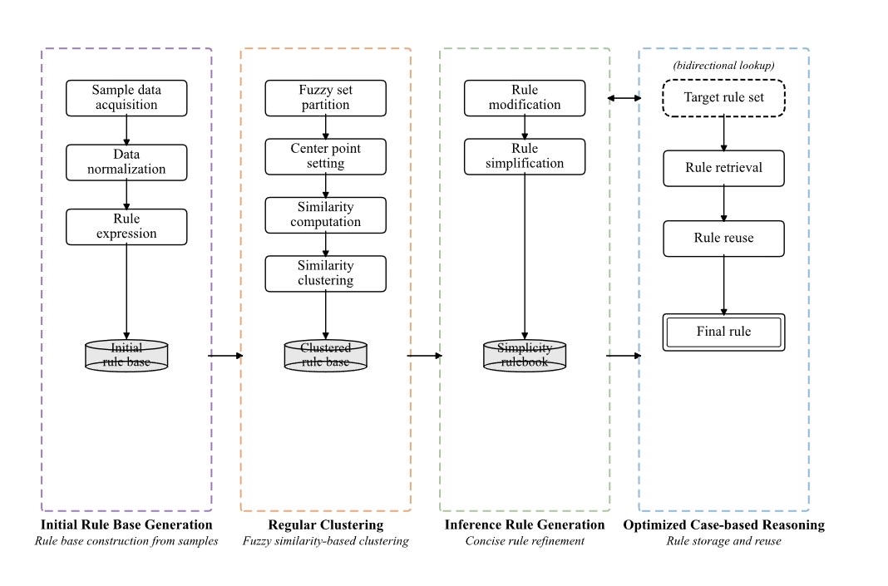
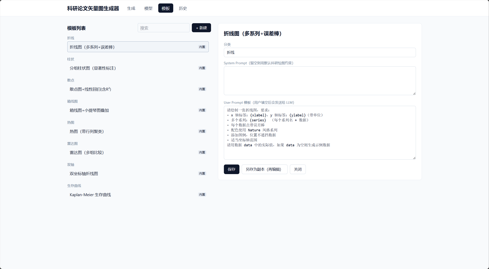
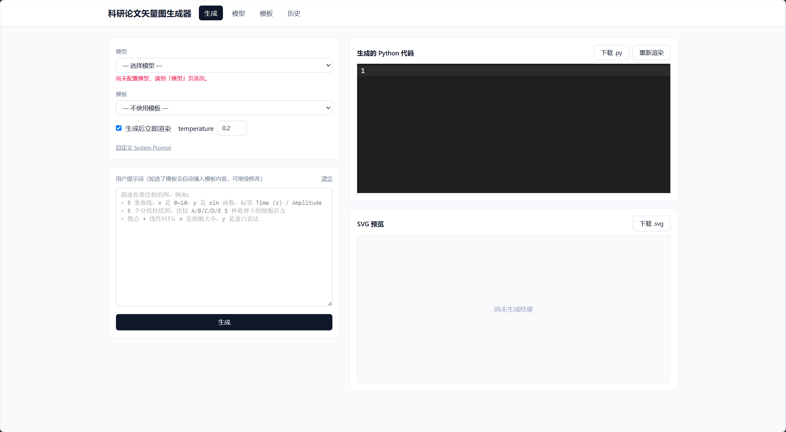

<p align="center">
  
</p>

<div align="right">

[English](README.md) | [简体中文](README.zh-CN.md) | [繁體中文](README.zh-TW.md)

</div>

# PlotCraft

**AI 驅動的科研論文向量圖產生器 · 沙箱渲染 · 期刊就位**

> 用自然語言描述你要畫的圖，PlotCraft 呼叫大模型產生 matplotlib 程式碼，在後端隔離沙箱中執行，直接產出可投 Nature / Cell / Science 級別的 SVG 向量圖——所有金鑰本地加密、所有程式碼本地執行、所有資料不出本機。

---

## 這是什麼



科研繪圖長期是論文寫作裡最磨人的環節：

- GraphPad / Origin 選項繁雜，滑鼠點十幾層選單才出一張圖；
- 手寫 matplotlib 調參繁瑣，配色、字型、統計標註、向量匯出每個都要查文件；
- AI 生圖工具（GPT-4 / Gemini）能寫程式碼但跑不起來，閉迴路只在聊天框裡。

PlotCraft 把「自然語言 → 程式碼 → 渲染 → 向量輸出」這條鏈路一次性打通：

1. 你在 Web 介面裡**用一句話描述要畫的圖**（「5 條曲線，x 是 0~10，y 是 sin 函數，標籤 Time (s) / Amplitude」）；
2. 後端用你接入的大模型產生 matplotlib Python 程式碼；
3. 程式碼被丟進**隔離子程序沙箱**執行，強制 `Agg` 後端、斷網、逾時 60 秒、禁止 import `os / sys / socket / subprocess / requests / pathlib` 等危險模組；
4. 渲染出的 `output.svg` 直接回傳到前端內聯預覽，可下載、可二次編輯程式碼後重新渲染；
5. 整個對話（prompt + 程式碼 + SVG）寫入本地 SQLite 歷史，可回溯、可清空。

**它不是另一個 ChatGPT 套殼**，而是把 LLM 產生程式碼後真正「跑出圖來」這一步做扎實了的本地化工具。

---

## 倉庫特點

### 🎯 向量優先，期刊就位
- 直接渲染 SVG（`plt.savefig(format="svg", dpi=300, bbox_inches="tight")`），無損縮放，可直接嵌入 LaTeX / Word / InDesign；
- system prompt 注入 **Nature 風格配色**（`#E64B35 #4DBBD5 #00A087 #3C5488 #F39B7F #8491B4`）與排版規範：軸標籤帶單位、字型大小分檔（軸 12pt / 刻度 10pt / 圖例 10pt / 標題 14pt）、統計標註語義化（`*p<0.05`、`**p<0.01`、`***p<0.001`）；
- 內建 8 類科研圖範本：折線（誤差棒）、分組長條（顯著性）、散點+迴歸、箱線+小提琴、熱圖、雷達、雙軸折線、Kaplan-Meier 存活曲線——涵蓋生命科學 / 材料科學 / 臨床醫學最常見圖型。

### 🔒 本地加密 · 金鑰不出本機
- AI 廠商 API Key 用 **Fernet 對稱加密**（`cryptography` 函式庫）後寫入本地 SQLite，金鑰由 `ONE_ENCRYPT_KEY` 環境變數持有；
- 前端只顯示去識別化後的 `api_key_masked`，明文金鑰永不下發；
- 不上傳任何第三方雲，自架部署時資料完全在使用者機器上。

### 🏝 沙箱執行 · LLM 程式碼不越權
- 每次渲染開一個暫存目錄（`tempfile.mkdtemp`），指令稿獨立執行完即刪；
- 環境變數層禁代理 (`NO_PROXY=*`)、強制 `MPLBACKEND=Agg`（不彈窗）；
- system prompt 硬性約束模型不得 import `os / sys / socket / requests / httpx / subprocess / shutil / pathlib / importlib`，不得讀寫 `output.svg` 之外的檔案；
- 子程序逾時 60 秒自動 `kill`，防止無窮迴圈；
- 渲染失敗時把 stderr 末段 500 字回傳前端，方便反覆修正程式碼。

### 🔌 模型即插即用 · 多供應商統一介面
- 內建兩個 provider：
  - `openai_compat`：相容 OpenAI Chat Completions 協定（DeepSeek / 通義千問 / Moonshot / 智譜 / Together / OpenRouter / 本地 vLLM 等只要相容 OpenAI 介面都可接）；
  - `gemini`：Google Gemini（`google-genai` SDK）；
- `replicate` 介面已預留，未來接入物理化點陣圖產生模型；
- 模型可在「模型」頁 UI 裡隨時增刪改，base_url / model_name / api_key / extra 欄位全部表單化設定，無需改程式碼。

### 📝 範本系統 · 內建可繼承，自訂可編輯
- 內建 8 張圖型範本帶 `system_prompt` + `user_template` 占位符（如 `{xlabel}`、`{series}`），啟動時自動播種到 SQLite；
- 內建範本唯讀（避免被誤改），可「另存為」再編輯成自己的版本；
- 範本支援 category 分類、前端按類別下拉篩選；
- 使用者提示詞編輯框接收範本內容後可繼續編輯，範本只是起點不是天花板。

### 🖥 現代前端 · 程式碼可改可重渲染
- React 19 + TypeScript 7 + Vite 8 + Tailwind 4；
- 內嵌 **CodeMirror**（VSCode Dark 主題 + Python 語法高亮），產生的程式碼可線上編輯；
- 「重新渲染」按鈕把改過的程式碼 POST 回 `/api/generate/render`，不消耗 LLM 配額；
- SVG 用 `dangerouslySetInnerHTML` 內聯預覽（沙箱已斷網，SVG 僅本地路徑），右鍵儲存即可；
- 下載按鈕：`.svg` 向量、`.py` 原始碼一鍵取走。

### 🗂 歷史回放 · 不丟任何一次實驗
- 每次產生（成功 / 失敗 / 僅程式碼）都進 `generations` 資料表，含 `model_id` / `template_id` / `user_input` / `generated_code` / `output_svg` / `status` / `error` / `created_at`；
- 「歷史」頁可查最近 50 筆、單筆刪除、全部清空；
- 失敗紀錄也保留，方便對照排查環境問題。

---

## 技術棧

| 層 | 技術 |
|---|---|
| 後端 | FastAPI · Pydantic · aiosqlite · aiofiles · cryptography · openai · google-genai |
| 渲染 | matplotlib（Agg 後端）· numpy · pandas · scipy（按需） |
| 前端 | React 19 · TypeScript 7 · Vite 8 · Tailwind 4 · @uiw/react-codemirror · react-router-dom 7 |
| 儲存 | SQLite（模型設定 / 範本 / 歷史） |
| 沙箱 | tempfile + subprocess + Agg + 斷網 + 逾時 kill |

---

## 專案結構

```
PlotCraft/
├── backend/
│   ├── app/
│   │   ├── main.py              FastAPI 入口，CORS + lifespan + 範本播種
│   │   ├── config.py            環境變數載入
│   │   ├── crypto.py            Fernet 加解密
│   │   ├── db.py                aiosqlite 連線 + 資料表初始化
│   │   ├── executor.py          沙箱執行（核心安全邊界）
│   │   ├── prompts.py           科研繪圖 system prompt 範本
│   │   ├── models.py            Pydantic 資料模型
│   │   ├── providers/
│   │   │   ├── base.py          Provider 抽象基底類別
│   │   │   ├── factory.py       provider 工廠
│   │   │   ├── openai_compat.py OpenAI 相容協定
│   │   │   └── gemini.py        Google Gemini
│   │   └── routes/
│   │       ├── generate.py       /api/generate + /api/generate/render
│   │       ├── history.py        歷史紀錄 CRUD
│   │       ├── models.py         模型設定 CRUD
│   │       └── templates.py      範本 CRUD + 啟動播種
│   ├── templates_seed/           8 個內建圖型 JSON
│   │   ├── 01_line_with_errorbar.json
│   │   ├── 02_grouped_bar_significance.json
│   │   ├── 03_scatter_regression.json
│   │   ├── 04_box_violin.json
│   │   ├── 05_heatmap.json
│   │   ├── 06_radar.json
│   │   ├── 07_dual_axis_line.json
│   │   └── 08_kaplan_meier.json
│   ├── requirements.txt
│   └── .env.example
├── frontend/
│   ├── src/
│   │   ├── App.tsx              路由 + 導覽
│   │   ├── main.tsx             入口
│   │   ├── index.css            Tailwind
│   │   ├── lib/api.ts           前端 API 客戶端
│   │   ├── components/
│   │   │   └── SetupBanner.tsx  未設定金鑰時引導
│   │   └── pages/
│   │       ├── Generate.tsx     產生主介面（核心）
│   │       ├── History.tsx      歷史
│   │       ├── ModelConfig.tsx  模型設定
│   │       └── Templates.tsx    範本管理
│   ├── index.html
│   ├── package.json
│   ├── tsconfig.json
│   └── vite.config.ts
└── .gitignore
```

---

## 快速開始

### 1. 後端

```bash
cd backend
python -m venv .venv
# Windows
.venv\Scripts\activate
# macOS / Linux
source .venv/bin/activate

pip install -r requirements.txt

# 產生 Fernet 金鑰
python -c "from cryptography.fernet import Fernet; print(Fernet.generate_key().decode())"

# 把金鑰寫入 .env
cp .env.example .env
# 編輯 .env，把上面輸出的金鑰填到 ONE_ENCRYPT_KEY=
# 同時可改 HOST / PORT / DB_PATH

# 啟動
uvicorn app.main:app --reload --port 8000
```

啟動後造訪 `http://127.0.0.1:8000/docs` 看 OpenAPI 文件。

### 2. 前端

```bash
cd frontend
npm install
npm run dev
```

開啟瀏覽器造訪終端機提示的 Vite 位址（預設 `http://localhost:5173`）。

### 3. 設定模型

進入「模型」頁，新增一個模型：

- **OpenAI 相容協定**（DeepSeek 範例）
  - `provider`: `openai_compat`
  - `base_url`: `https://api.deepseek.com/v1`
  - `model_name`: `deepseek-chat`
  - `api_key`: 你的 DeepSeek key
- **Gemini**
  - `provider`: `gemini`
  - `model_name`: `gemini-2.5-flash`
  - `api_key`: Google AI Studio key
- **本地 vLLM / Ollama（OpenAI 相容）**
  - `base_url`: `http://localhost:8000/v1`（vLLM）或 `http://localhost:11434/v1`（Ollama）
  - `api_key`: 本地服務可填任意非空字串

### 4. 產生第一張圖

1. 進「產生」頁，選模型 + 選範本（例如「散點 + 線性迴歸」）；
2. 範本 prompt 自動填入編輯框，按你的資料改寫：
   ```
   請繪製一張散點 + 線性迴歸圖：
   - x: 細胞直徑 (μm)，y: 蛋白表現量 (RFU)
   - 30 個樣本，散點帶雜訊
   - 擬合直線 + 95% 信賴區間陰影
   - 圖內顯示 R² 和 p 值
   - Nature 風格配色
   ```
3. 點「產生」 → 幾秒後右側出 SVG 預覽；
4. 滿意 → 下載 `.svg` / `.py`；不滿意 → 在 CodeMirror 裡改程式碼 →「重新渲染」不消耗 LLM 配額。

---

## 效果演示

下面三張圖全部由 PlotCraft 產生——自然語言輸入，LLM 產生 matplotlib 程式碼，後端沙箱執行渲染，匯出 SVG（此處為 GitHub 預覽重新柵格化）。

<p align="center">
  
  
</p>
<p align="center"><em>左：多系列折線 + 誤差棒 · 中：分組長條 + 顯著性標註 · 右：散點 + 線性迴歸 + 95% 信賴區間</em></p>

---

## 內建範本清單

| # | 類別 | 範本名 | 典型場景 |
|---|---|---|---|
| 01 | 折線 | 折線圖（多系列+誤差棒） | 時序響應、劑量-效應曲線 |
| 02 | 長條 | 分組長條圖（顯著性） | 多處理組比較 + ANOVA 顯著性標註 |
| 03 | 散點 | 散點 + 線性迴歸 | 相關性分析、R² / p 值標註 |
| 04 | 分佈 | 箱線 + 小提琴 | 組間分佈對比、批次效應檢查 |
| 05 | 熱圖 | 熱圖 | 基因表現、混淆矩陣 |
| 06 | 雷達 | 雷達圖 | 多維評分對比 |
| 07 | 雙軸 | 雙軸折線 | 不同量綱同圖（如溫度 vs 產率） |
| 08 | 存活 | Kaplan-Meier | 存活分析 + log-rank 檢定 |

---

## 安全模型

| 風險 | 緩解措施 |
|---|---|
| LLM 產生惡意程式碼讀取本地檔案 | system prompt 禁用 `os/sys/pathlib/subprocess/open()` 等 import；執行子程序無 `~` 存取隔離的暫存目錄 |
| LLM 呼叫公網外洩資料 | system prompt 禁用 `socket/requests/httpx`；env 設 `NO_PROXY=*`；下游相依可進一步用網路命名空間隔離 |
| 無窮迴圈 / 死結耗盡 CPU | 子程序 60 秒逾時自動 `kill` |
| API Key 洩漏 | Fernet 對稱加密入資料庫；前端只接收去識別化字串 |
| SVG XSS | SVG 內聯渲染僅在前端 DOM，沙箱斷網，不執行外部資源載入 |

> ⚠️ **生產部署提示**：本倉庫 CORS 預設 `allow_origins=["*"]`，適合本地單人使用。多使用者/公網部署請改為白名單前端網域，並加上認證層。

---

## 適用與不適用

**適合**
- 個人科研工作者 / 研究生 / 博士後快速產出論文配圖
- 實驗室內部共享繪圖工具（自架在組內伺服器）
- 教學：讓學生觀察 LLM 如何把自然語言對應成可執行 matplotlib 程式碼

**不適合**
- 需要嚴格合規審計的企業級多人協作（無認證 / 稽核記錄）
- 取代專業出版工具（Adobe Illustrator 仍可對 SVG 做最後微調）
- 處理需要互動式 3D / 大資料 WebGL 渲染的圖（沙箱只跑 matplotlib）

---

## 路線圖

- [ ] PDF / EPS 匯出（目前僅 SVG）
- [ ] 批次產生（一次 prompt 多張子圖拼 panel）
- [ ] 複製圖型參數到新資料（「換資料不換風格」）
- [ ] Replicate / FAL 物理化點陣圖 provider 接入
- [ ] 使用者態 sandpack-js 在瀏覽器側預渲染，省 Python 子程序開銷

---

## 授權條款

本倉庫當前未宣告開源授權條款。在新增 LICENSE 檔案之前，預設適用作者保留全部版權的隱式條款——可參考使用，但再散布 / 衍生 / 商用前請聯絡作者授權。

---

## 致謝

- 配色靈感：[ggsci - Nature 期刊配色](https://github.com/nanxstats/ggsci)
- 範本思路：matplotlib gallery + 論文圖慣例
- 沙箱思路：Jupyter `%%script` / `nbconvert` isolate 模式
